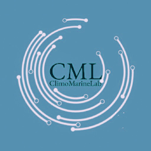

# ClimoMarineLab
# A personal project to share knowledge
**Research Analytic Solutions** \
*Your Phantom Collaborator in the Research* \
 \
Contact us: *climomarinelab@gmail.com*

Embark on a research journey with **ClimoMarineLab**, your phantom research collaborator in the realm of Maine-Atmosphere-Climate Change. With over a decade of honed expertise, our teams' core strengths lie in scientific programming, analytical finesse, and adept management of atmospheric-oceanographic data.

# Skills

**Data Science Solutions:** We deliver comprehensive solutions for **data processing, analysis, and impactful visualization**, empowering informed decision-making.

**Custom Scientific Coding:** Crafted with precision, our coding solutions range from basic scripts to advanced automation, tailored to meet specific project objectives.

**Remote Sensing and Model Data Services:** From **acquisition** to **visualization**, we offer end-to-end services for both **remote sensing and model data analyses**.

**Statistical Insights:** Our suite of statistical services includes correlations, cross-correlations, regressions, multivariate analysis, PCA, and application of machine learning techniques.

**Time Series Analysis Expertise:** Specializing in trend and pattern recognition, FFT, wavelet analysis, spectrum analysis, predictions, and other advanced time series analysis techniques.

**Ocean Modeling and Climate Projections Analysis:** We provide specialized analysis services for 1-D and 3-D models, along with in-depth assessments of RCPs and SSPs projection data.

**Marine and Geospatial Data Solutions:** Tailored solutions for mapping, pixel extractions, feature identification, EOF analysis, remote sensing reflectance, ocean color analysis, and more.

*Discover the depth of our capabilities as we navigate the complexities of marine and atmospheric sciences, providing bespoke solutions that redefine the contours of research excellence.*
